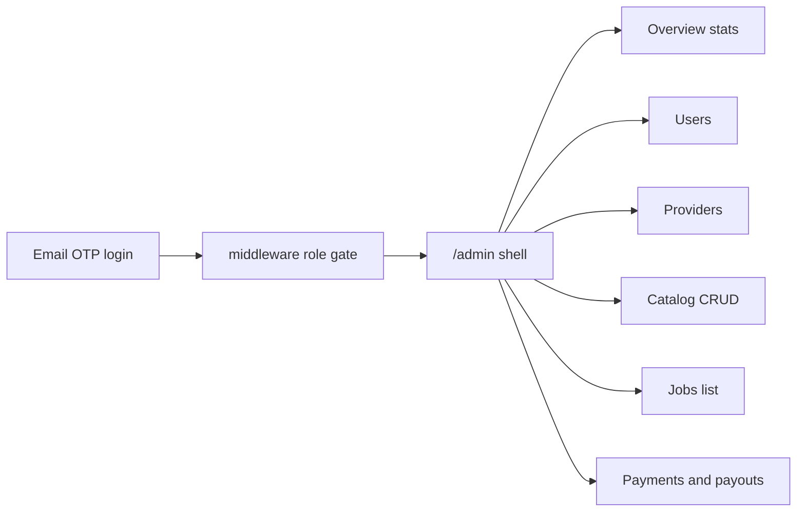

# Admin Dashboard for Exterior Pro

An admin dashboard already exists at `/admin` (navy sidebar, role-gated by middleware + layout + `adminProcedure`). Login already routes `ADMIN` to `/admin`. This work **rebuilds that surface** so it feels like a different product from the customer/provider glass top-nav, and fills the capability gaps you asked for.

Login for the new account: email OTP to `verawebdev@protonmail.com` (same as every other seeded user — no password).

## What else an admin should be able to do

For a two-sided exterior-services marketplace, a useful operator console is:

- **Catalog** — categories and services (your must-have)
- **Trust and access** — users, suspend/verify, provider approval, Stripe Connect status
- **Money** — payments, platform fees, provider transfers (refunds later)
- **Marketplace ops** — jobs, bids, subscriptions, plan catalog
- **Quality** — job photos, disputes
- **Platform config** — fees, audit log (no model today)

**This pass (your selections):** catalog CRUD, rebuilt admin shell, user overview/stats/management, provider detail, payments/payouts. Jobs stay as a restyled read-only list.

**Later (not this pass):** subscription plan CRUD, job force-status/cancel, subscription pause/assign, photo moderation, broadcasts, fee settings, audit log.

## 1. Seed the admin user

In [packages/db/prisma/seed.ts](packages/db/prisma/seed.ts), keep `admin@example.com` and add a second verified admin via `upsertLoginUser`:

- email: `verawebdev@protonmail.com`
- role: `ADMIN`
- no phone (avoids colliding with `+10000000000` on the existing admin)
- `verified: true`

Update the seed summary log so both admin emails print.

## 2. Complete catalog CRUD (API)

Public `service.listCategories` only returns **active** services, so deactivated items vanish from the current admin page.

In [packages/api/src/routers/service.ts](packages/api/src/routers/service.ts) and [packages/validators/src/service.ts](packages/validators/src/service.ts):

- Add `listCategoriesAdmin` (`adminProcedure`) that includes inactive services
- Wire category/service **update** into the UI (API already exists)
- Allow moving a service (`categoryId` on `updateServiceInput`)
- Optional `image` on category create/update (already on `ServiceCategory`)
- Soft-delete: deactivate services (existing `active` flag)
- Hard-delete only when unused: `deleteService` if no jobs / planServices / providerServices; `deleteCategory` if it has no services

## 3. Admin API for users, providers, money

Extend [packages/api/src/routers/admin.ts](packages/api/src/routers/admin.ts):

- `getStats` — add failed payments, unverified providers, pending payouts so the overview has an ops queue
- `getUser` — profile, properties count, recent jobs/subscriptions/payments
- `setProviderVerified` — verify **and** unverify (replace one-way `verifyProvider` or wrap it)
- `getProvider` — business profile, services + custom prices, crews, Stripe Connect flags, recent transfers, recent jobs
- `listPayments` — paginated, filter by `status` / `kind`, include customer, job, subscription, transfers, `receiptUrl`
- `listTransfers` — paginated, filter by status, include provider + payment

No refunds/retries in this pass (read-only money views + Stripe receipt links).

## 4. Rebuild the admin shell

Keep the **sidebar** so admin stays visually distinct from customer/provider. Restyle it to match dashboard primitives already used on those apps.

[apps/web/src/app/(admin)/admin/layout.tsx](<apps/web/src/app/(admin)/admin/layout.tsx>):

- Lucide icons instead of emoji
- `Link` nav (Overview, Users, Providers, Services, Jobs, Payments)
- Same mist/night background, `Button` / `ThemeToggle`, toast via existing Sonner
- Drop `alert()` on all admin pages

Reuse [DashboardHero](apps/web/src/components/dashboard/dashboard-hero.tsx), [StatTiles](apps/web/src/components/dashboard/stat-tiles.tsx), [SectionPanel](apps/web/src/components/dashboard/section-panel.tsx), [FilterPills](apps/web/src/components/dashboard/filter-pills.tsx), [EmptyState](apps/web/src/components/dashboard/empty-state.tsx), plus `Button`, `Badge`, `Dialog`, `Input`, `Label`, `Select`.

## 5. Pages

**Overview** — [apps/web/src/app/(admin)/admin/page.tsx](<apps/web/src/app/(admin)/admin/page.tsx>)

- Stat tiles linking into Users / Jobs / Payments / Providers
- “Needs attention” panel: unverified providers, failed payments
- Keep “Sync plans to Stripe”

**Users** — polish [users/page.tsx](<apps/web/src/app/(admin)/admin/users/page.tsx>)

- Search (email/phone — API already supports it)
- Role filters including `CREW`
- Summary counts + verify/suspend
- New [users/[id]/page.tsx](<apps/web/src/app/(admin)/admin/users/[id]/page.tsx>) for profile, properties, recent jobs/payments (read-only)

**Providers** — restyle list; add [providers/[id]/page.tsx](<apps/web/src/app/(admin)/admin/providers/[id]/page.tsx>)

- Verify / unverify
- Service area, offered services, crews
- Stripe Connect (`stripeAccountId`, `stripeTransfersEnabled`)
- Payout history from transfers

**Services** — full CRUD in [services/page.tsx](<apps/web/src/app/(admin)/admin/services/page.tsx>)

- Create/edit category (dialog)
- Create/edit service (name, description, price, unit, category)
- Show inactive services; activate/deactivate
- Delete when unused, otherwise toast why it cannot be deleted

**Jobs** — restyle only (filters + table); no force-status this pass

**Payments (new)** — `/admin/payments`

- Filter by kind/status
- Amount, fee, transfer, customer, receipt link
- Optional payouts tab or section using `listTransfers`

## How you will use it

After seed (`npm run db:seed` in `@repo/db`), log in at `/login` with `verawebdev@protonmail.com`. Middleware sends `ADMIN` to `/admin`.
