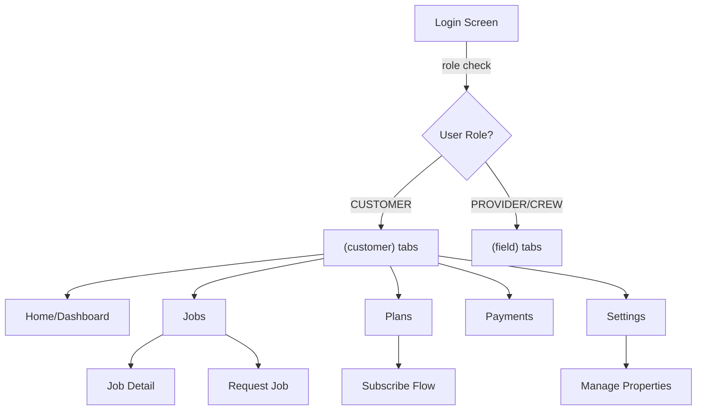

# Customer Mobile Views Implementation Plan

## Architecture Overview

Transform the mobile app from field-only to a unified app that detects user role at login and routes to either customer or field screens. The customer experience will mirror the web app with tabs for Home, Jobs, Plans, Payments, and Settings.



## File Structure

Create new customer route group parallel to existing `(field)`:

```
apps/native/app/
├── (customer)/                    # NEW
│   ├── _layout.tsx               # Customer tabs shell
│   ├── index.tsx                 # Home/dashboard
│   ├── jobs/
│   │   ├── _layout.tsx          # Jobs stack
│   │   ├── index.tsx            # Jobs list
│   │   ├── [id].tsx             # Job detail + bids
│   │   └── new.tsx              # Request job form
│   ├── plans/
│   │   ├── _layout.tsx          # Plans stack
│   │   ├── index.tsx            # Browse plans
│   │   └── [id].tsx             # Plan detail + subscribe
│   ├── payments.tsx             # Payments list (single screen)
│   └── settings.tsx             # Settings + properties
└── index.tsx                     # MODIFY: role-based routing
```

## Core Changes

### 1. Update Root Router

**File:** [`apps/native/app/index.tsx`](apps/native/app/index.tsx)

Currently redirects all authenticated users to `/today` (field-only). Modify to:

- Check `user.role`
- Route `CUSTOMER` → `/customer` (new)
- Route `PROVIDER`/`CREW` → `/today` (existing)
- Unauthenticated → `/login`

### 2. Update Login Flow

**File:** [`apps/native/app/(auth)/login.tsx`](<apps/native/app/(auth)/login.tsx>)

Currently rejects non-field users with error. Modify to:

- Remove the field-only rejection logic at lines 68-73
- Allow customers to log in
- Let root router handle role-based redirect

### 3. Create Customer Tab Layout

**File:** `apps/native/app/(customer)/_layout.tsx` (new)

Create tabs shell following the pattern from [`apps/native/app/(field)/_layout.tsx`](<apps/native/app/(field)/_layout.tsx>):

- Tabs: Home, Jobs, Plans, Payments, Settings
- Use same styling (`brand-night` bg, lime accent)
- Gate with `requiresAuth` and `role === 'CUSTOMER'`
- Icons: `home`, `briefcase`, `calendar-outline`, `card`, `settings`

## Screen Implementations

### Home/Dashboard (`index.tsx`)

**Mirrors:** [`apps/web/src/app/(customer)/customer/page.tsx`](<apps/web/src/app/(customer)/customer/page.tsx>)

**Features:**

- Properties carousel (swipeable cards with photos, job counts, "Request service" button)
- Quick stats tiles (active jobs, upcoming visits, spent this month)
- Recent activity feed (last 5-7 items: bids received, jobs completed, etc.)
- "Add your first property" prompt if no properties exist

**tRPC calls:**

- `property.list` - carousel
- `job.listForCustomer` - stats + activity
- `payment.listForCustomer` - spending stats

**UI Pattern:** `Screen` → `ScrollView` → `PropertyCarousel` → `StatTiles` → `ActivityFeed`

### Jobs List (`jobs/index.tsx`)

**Mirrors:** [`apps/web/src/app/(customer)/customer/jobs/page.tsx`](<apps/web/src/app/(customer)/customer/jobs/page.tsx>)

**Features:**

- Filter pills (All, Open, Pending, Scheduled, In Progress, Completed, Cancelled)
- Job cards showing: service name, property address, status badge, date, bid count
- Tap card → navigate to detail
- FAB "+" button → navigate to new job request
- Empty state with "Request your first job" CTA

**tRPC calls:**

- `job.listForCustomer` with status filter

**UI Pattern:** `Screen` → `FilterPills` → `FlatList` of `JobCard` → `FAB`

### Job Detail (`jobs/[id].tsx`)

**Mirrors:** [`apps/web/src/app/(customer)/customer/jobs/[id]/page.tsx`](<apps/web/src/app/(customer)/customer/jobs/[id]/page.tsx>)

**Features:**

- Job header (service, status, property, date)
- Bids section (if OPEN): list with provider info, price, accept/decline buttons
- Schedule card (if scheduled): date/time, crew members
- Payment card (if paid): amount, status, receipt link
- Photos gallery (before/after if completed)
- Customer notes
- Actions: Cancel (if OPEN), Rebook (if COMPLETED), Call provider

**tRPC calls:**

- `job.getForCustomer` with photos
- `bid.listForJob`
- `bid.accept` / `bid.decline` mutations
- `job.cancelForCustomer` mutation

**UI Pattern:** `Screen` → `ScrollView` → `Card` sections → action buttons

### New Job Request (`jobs/new.tsx`)

**Mirrors:** [`apps/web/src/app/(customer)/customer/jobs/new/page.tsx`](<apps/web/src/app/(customer)/customer/jobs/new/page.tsx>)

**Features:**

- Multi-step form wizard:
  1. Select service category → service
  2. Select property (or "Add new property")
  3. Add customer notes (textarea)
  4. Optional: take/select before photos
- Submit → creates job, shows success, navigates to job detail

**tRPC calls:**

- `service.listCategories` → `service.list` by category
- `property.list` - property picker
- `job.create` mutation

**UI Pattern:** `Screen` → form steps → `PrimaryButton` submit

### Plans List (`plans/index.tsx`)

**Mirrors:** [`apps/web/src/app/(customer)/customer/plans/page.tsx`](<apps/web/src/app/(customer)/customer/plans/page.tsx>)

**Features:**

- List of available subscription plans
- Each plan card: name, description, included services, pricing (monthly/quarterly/annual)
- "View details" → navigate to plan detail
- Show "Currently subscribed" badge if user has active subscription for this plan

**tRPC calls:**

- `subscription.listPlans`
- `subscription.listForCustomer` - check active subs

**UI Pattern:** `Screen` → `FlatList` of plan cards

### Plan Detail & Subscribe (`plans/[id].tsx`)

**Mirrors:** Web plan detail + subscription flow

**Features:**

- Plan details (services, frequency, pricing tiers)
- Property selector (which property for this subscription)
- Billing frequency picker (monthly/quarterly/annual)
- "Subscribe" button → `subscription.subscribe` → opens Stripe Checkout URL in browser
- Link to manage existing subscriptions

**tRPC calls:**

- `subscription.getPlan`
- `property.list` - property picker
- `subscription.subscribe` mutation

**UI Pattern:** `Screen` → plan info cards → form → `PrimaryButton`

### Payments List (`payments.tsx`)

**Mirrors:** [`apps/web/src/app/(customer)/customer/payments/page.tsx`](<apps/web/src/app/(customer)/customer/payments/page.tsx>)

**Features:**

- Summary stats (total spent, YTD)
- Filter pills (All, Job payments, Subscription payments)
- Payment cards: amount, date, status, job/plan name, "View receipt" link
- Open receipt URLs in browser

**tRPC calls:**

- `payment.listForCustomer`

**UI Pattern:** `Screen` → stats → `FilterPills` → `FlatList` of payment cards

### Settings (`settings.tsx`)

**Mirrors:** Customer settings from web + existing native settings pattern from [`apps/native/app/(field)/settings.tsx`](<apps/native/app/(field)/settings.tsx>)

**Features:**

- Profile section: edit name, email (phone read-only)
- Properties section: list with edit/delete, "Add property" button → modal/sheet
- Notifications toggle (push preferences)
- Theme toggle (dark/light)
- Support links
- App version
- Sign out

**tRPC calls:**

- `auth.me`
- `auth.updateCustomerProfile` mutation
- `property.list` / `create` / `update` / `delete`

**UI Pattern:** `Screen` → `ScrollView` → section `Card`s → modals/sheets for CRUD

## Reusable Components

Create customer-specific components in `apps/native/src/components/customer/`:

1. **PropertyCarousel** - swipeable property cards (adapt from web carousel)
2. **JobCard** - reusable job list item (can share with field app pattern)
3. **BidCard** - bid display with accept/decline actions
4. **PlanCard** - subscription plan display
5. **PaymentCard** - payment history item
6. **PropertyForm** - add/edit property modal (address, notes)
7. **ServicePicker** - category → service selection UI
8. **ActivityFeedItem** - recent activity list item

Follow existing UI patterns:

- Use `Card` from `@/components/ui/card`
- Use `PrimaryButton` from `@/components/ui/button`
- Use `Ionicons` for icons
- Use NativeWind/`className` for styling
- Use `colors` from `@/lib/theme` (night background, lime accents)

## Data Flow

All customer screens use existing tRPC routes:

- Auth: `auth.me`, `auth.updateCustomerProfile`
- Properties: `property.list/getById/create/update/delete`
- Jobs: `job.listForCustomer/getForCustomer/create/cancelForCustomer`
- Bids: `bid.listForJob/accept/decline`
- Services: `service.listCategories/list/getById` (public)
- Plans: `subscription.listPlans/getPlan` (public)
- Subscriptions: `subscription.listForCustomer/subscribe/cancel/pause/resume`
- Payments: `payment.listForCustomer`
- Notifications: `notification.list/markRead/markAllRead`

No new API routes needed - full parity with web app APIs.

## Navigation & UX

- **Onboarding:** If customer has no properties, show "Add your first property" prompt on home (required before job requests)
- **Job lifecycle:** Open → review bids → accept (pay via Stripe web checkout) → pending → scheduled → in progress → completed
- **Checkout flow:** Accept bid or subscribe opens Stripe Checkout URL in system browser (Expo `Linking`), then return to app
- **Notifications:** Reuse existing push notification system, just route customers to customer job detail instead of field job detail
- **Theme:** Support light/dark like web, persisted in settings

## Testing Checklist

1. Customer login works, routes to customer home
2. Field user login still routes to field home (no regression)
3. Property CRUD flow (add, edit, delete)
4. Job request → bid review → accept → payment
5. Plan subscription flow → Stripe checkout → manage subscription
6. Payment history loads and receipt links work
7. Settings profile update persists
8. Push notifications route to correct screens by role
9. Theme toggle works across all customer screens
10. Empty states show for new customers (no properties, no jobs)

## Key Implementation Notes

- **Image uploads:** Use `expo-image-picker` (already configured) for property photos and job before photos
- **Maps:** Add `expo-location` and `react-native-maps` for property location display (optional enhancement)
- **Web checkout:** Use `Linking.openURL()` for Stripe checkout and billing portal URLs
- **Offline handling:** Not in scope for now (can add optimistic updates later)
- **Loading states:** Use `LoadingScreen` component for queries, skeleton for lists
- **Error handling:** Use `Alert.alert()` for mutation errors, toast for successes
