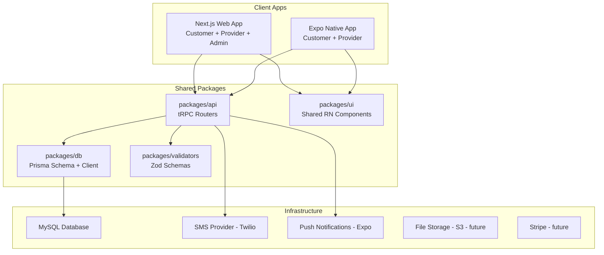
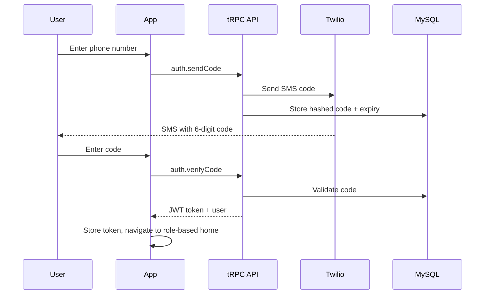

# Exterior Pro - Full Development Plan

## Architecture Overview

The existing Turborepo monorepo will be extended with new shared packages for the backend and database layer. Both the web and native apps will consume the same tRPC API.



## New Packages to Create

- `**packages/db**` -- Prisma schema, client, migrations, seed scripts. All apps import `@repo/db`.
- `**packages/api**` -- tRPC router definitions, context, middleware (auth, role guards). Consumed by Next.js API route handler and Expo via HTTP client.
- `**packages/validators**` -- Shared Zod schemas for input validation (used by both tRPC procedures and client-side forms).

## Database Schema (Prisma + MySQL)

Core models for the MVP:

```
User              -- id, phone, role (CUSTOMER|PROVIDER|ADMIN), verified, createdAt
CustomerProfile   -- userId, firstName, lastName, email (optional)
ProviderProfile   -- userId, businessName, description, serviceArea, verified
Property          -- id, customerId, address, city, state, zip, notes
ServiceCategory   -- id, name, description, icon
Service           -- id, categoryId, name, description, basePrice, unit (sqft/hour/flat)
Quote             -- id, propertyId, serviceId, providerId, customPrice, status, notes
Job               -- id, quoteId, status (PENDING|SCHEDULED|IN_PROGRESS|COMPLETED|CANCELLED), scheduledDate, scheduledTime, completedAt
Crew              -- id, providerId, name
CrewMember        -- id, crewId, name, phone, role
JobAssignment     -- id, jobId, crewId, assignedAt
RecurringSchedule -- id, jobId, frequency (WEEKLY|BIWEEKLY|MONTHLY), nextDate
Notification      -- id, userId, type, title, body, read, createdAt
VerificationCode  -- id, phone, code, expiresAt (for SMS auth)
```

## Auth Flow (Phone/SMS)



- JWT stored in httpOnly cookies (web) and SecureStore (native)
- Role-based middleware in tRPC context guards routes by user role
- New users go through onboarding after first verification (choose role, fill profile)

---

## MVP Phases

### Phase 1: Foundation (Backend + Auth + DB)

**Goal**: Establish the full backend stack and phone-based authentication.

**Tasks**:

- Create `packages/db`: Prisma schema with all core models, MySQL connection, seed script
- Create `packages/api`: tRPC setup with context, auth middleware, role-based guards
- Create `packages/validators`: Zod schemas for auth inputs, service inputs, job inputs
- Wire tRPC into Next.js via App Router API route (`apps/web/src/app/api/trpc/[trpc]/route.ts`)
- Implement auth router: `auth.sendCode`, `auth.verifyCode`, `auth.me`, `auth.logout`
- Integrate Twilio (or similar) for SMS delivery
- Set up JWT-based session management
- Create role selection + onboarding flow (post-verification)
- Set up MySQL locally (Docker Compose recommended) and in CI

**Key files**:

- `packages/db/prisma/schema.prisma`
- `packages/db/src/index.ts` (Prisma client export)
- `packages/api/src/trpc.ts` (init, context, middleware)
- `packages/api/src/routers/auth.ts`
- `apps/web/src/app/api/trpc/[trpc]/route.ts`
- `docker-compose.yml` (MySQL)

---

### Phase 2: Service Catalog + Customer Flow

**Goal**: Customers can browse services, manage properties, and request quotes.

**Tasks**:

- Implement service router: `service.list`, `service.getByCategory`, `service.getById`
- Implement property router: `property.create`, `property.list`, `property.update`, `property.delete`
- Implement quote router: `quote.request`, `quote.listForCustomer`, `quote.accept`, `quote.decline`
- Admin seeds predefined service categories and services
- Build customer-facing screens (both web and native):
  - Home / service browsing
  - Service detail page
  - Property management (add address, notes)
  - Quote request form (select service + property, add details)
  - My quotes / my jobs list
- Build shared UI components in `packages/ui`:
  - ServiceCard, PropertyCard, QuoteCard, JobCard
  - Form inputs (phone input, address input, text areas)
  - Status badges, bottom navigation

---

### Phase 3: Provider Portal + Dispatch

**Goal**: Providers manage their business, crews, quotes, and job assignments.

**Tasks**:

- Implement provider router: `provider.getProfile`, `provider.updateProfile`, `provider.setServiceArea`
- Implement crew router: `crew.create`, `crew.addMember`, `crew.list`, `crew.removeMember`
- Implement job router: `job.listForProvider`, `job.assign`, `job.updateStatus`, `job.complete`
- Implement scheduling router: `schedule.setAvailability`, `schedule.createRecurring`, `schedule.getUpcoming`
- Quote response flow: provider receives quote requests, sets custom price, accepts/declines
- Job dispatch: assign crews to jobs, set scheduled date/time
- Build provider-facing screens (both web and native):
  - Provider dashboard (pending quotes, today's jobs, crew overview)
  - Quote management (review, price, respond)
  - Job management (calendar view, assign crew, mark status)
  - Crew management (add/edit/remove crews and members)
  - Recurring schedule setup
- Provider onboarding flow (business info, service areas, services offered)

---

### Phase 4: Admin Dashboard (Web Only)

**Goal**: Platform admin manages users, services, and oversees all operations.

**Tasks**:

- Implement admin router: `admin.listUsers`, `admin.verifyProvider`, `admin.manageServices`, `admin.getStats`
- Build admin web dashboard at `/admin` route group:
  - Overview/analytics (total users, jobs, revenue potential)
  - User management (list, view, suspend customers/providers)
  - Provider verification/approval workflow
  - Service catalog management (CRUD categories + services + pricing)
  - Job oversight (all jobs, filter by status/provider/date)
- Role-based route protection (admin middleware on web)
- Admin layout with sidebar navigation

---

### Phase 5: Notifications (Push + SMS)

**Goal**: Real-time notifications for job updates, quote responses, and reminders.

**Tasks**:

- Implement notification router: `notification.list`, `notification.markRead`, `notification.getUnreadCount`
- Expo push notification setup (expo-notifications, push tokens stored per user)
- SMS notifications via Twilio for critical events (job confirmed, crew on the way)
- Notification triggers (via tRPC middleware or service layer):
  - Customer: quote received, job scheduled, job completed
  - Provider: new quote request, job reminder, schedule change
  - Admin: new provider signup, flagged issues
- In-app notification center (bell icon with unread count, list view)
- Push notification handling in Expo (foreground + background)

---

## Mobile App Phases (Expo / React Native)

The native app reuses the existing `@repo/api`, `@repo/validators`, and `@repo/ui` packages. Both Customer and Provider roles get native screens. Admin remains web-only.

---

### Mobile Phase 1: Expo App Foundation

**Goal**: Wire the Expo app to the existing tRPC backend with secure auth storage.

**Tasks**:

- Install `@trpc/client`, `superjson`, `expo-secure-store` in `apps/native`
- Create `apps/native/lib/trpc.ts` — tRPC client with `httpBatchLink` pointing to the web app's `/api/trpc` endpoint
- Create `apps/native/lib/auth.ts` — token helpers using `expo-secure-store` (getToken, setToken, clearToken)
- Set up `apps/native/app/_layout.tsx` — root layout with an auth context provider and auth guard
- Configure `apps/native/app.json` with proper scheme, splash screen, and icon

**Key files**:

- `apps/native/lib/trpc.ts`
- `apps/native/lib/auth.ts`
- `apps/native/context/AuthContext.tsx`
- `apps/native/app/_layout.tsx`

---

### Mobile Phase 2: Auth Screens

**Goal**: Full phone/SMS auth flow mirroring the web experience.

**Tasks**:

- `apps/native/app/(auth)/login.tsx` — phone number input with country code, send verification code
- `apps/native/app/(auth)/verify.tsx` — 6-digit code input with auto-focus, countdown timer for resend
- `apps/native/app/(auth)/role.tsx` — customer vs provider role selection with styled cards
- `apps/native/app/(auth)/onboarding.tsx` — profile form (customer: name/email, provider: business name/description/area)
- After successful auth, store JWT in SecureStore and navigate to role-based tab navigator

---

### Mobile Phase 3: Customer App

**Goal**: Customers can browse, book, and track services from their phone.

**Tasks**:

- Create `apps/native/app/(customer)/_layout.tsx` — bottom tab navigator (Home, Services, Properties, Quotes, Jobs)
- Home tab: dashboard with active job count, pending quotes, quick action buttons
- Services tab: category list with collapsible service cards, "Get Quote" buttons
- Properties tab: property list with add/edit/delete, address form with state picker
- Quotes tab: list with status badges, accept/decline actions on SENT quotes
- Jobs tab: filterable job list with status chips, scheduled date display, crew info
- Quote request flow: select service -> select property -> select provider -> add notes -> submit

---

### Mobile Phase 4: Provider App

**Goal**: Providers manage their business on the go.

**Tasks**:

- Create `apps/native/app/(provider)/_layout.tsx` — bottom tab navigator (Dashboard, Quotes, Jobs, Crews, Profile)
- Dashboard tab: stat cards (pending quotes, active jobs, completed, crews), upcoming jobs list
- Quotes tab: pending quotes with respond action (set price, add notes), quote history
- Jobs tab: job list with schedule action (date/time picker), assign crew, status update buttons
- Crews tab: crew list with member management, add crew/member forms
- Profile tab: edit business info, manage offered services with custom pricing toggles

---

### Mobile Phase 5: Shared UI Components

**Goal**: Extend `packages/ui` with React Native components used across both apps.

**Tasks**:

- `StatusBadge` — colored pill component for quote/job statuses
- `ServiceCard` — service display with price and unit
- `PropertyCard` — address display with notes preview
- `QuoteCard` — quote summary with status, price, provider/customer info
- `JobCard` — job summary with schedule, crew, and status
- `FormInput` / `FormTextArea` — styled text inputs with labels and validation errors
- `PhoneInput` — phone number input with +1 prefix and formatting
- `EmptyState` — illustration + message for empty lists
- `LoadingSpinner` — consistent loading indicator
- Ensure all components work on both iOS and Android, and degrade gracefully on web via react-native-web

---

### Mobile Phase 6: Push Notifications

**Goal**: Real-time push notifications for critical events on the native app.

**Tasks**:

- Install `expo-notifications` and `expo-device`
- Request notification permissions on app launch (iOS + Android)
- Register Expo push token and send to backend via `notification.registerPushToken`
- Handle foreground notifications (in-app banner)
- Handle background/killed-state notifications (navigate to relevant screen on tap)
- Notification triggers (server-side, extend `packages/api/src/lib/notifications.ts`):
  - Send Expo push to customer on: quote received, job scheduled, job in progress, job completed
  - Send Expo push to provider on: new quote request, quote accepted, job reminder
- Add notification badge count on app icon

---

### Mobile Phase 7: Polish & UX

**Goal**: Production-quality mobile experience.

**Tasks**:

- Loading skeletons for all list screens (instead of "Loading..." text)
- Pull-to-refresh on all list screens
- Error boundary with retry button
- Offline detection banner ("No internet connection")
- Haptic feedback on key actions (submit quote, accept, complete job)
- Keyboard-aware scroll views on all form screens
- Safe area handling for notched devices
- Dark mode support (optional, but wire up the theme system)
- App icon and splash screen assets
- Test on iOS simulator and Android emulator

---

## Post-MVP Roadmap (Architecture-Ready, Build Later)

- **Payments (Stripe)**: Customer payments, provider payouts, invoicing. Schema already includes Quote with pricing fields.
- **Media Uploads**: Before/after photos, property documentation. Will add S3/Cloudflare R2 integration and `Media` model.
- **Maps Integration**: Job location pins, crew routing, service area visualization. Address model already stores structured address data.
- **Advanced Scheduling**: Route optimization, automatic crew assignment, conflict detection.
- **Reviews & Ratings**: Customer reviews of completed jobs, provider ratings.
- **Chat/Messaging**: In-app messaging between customers and providers.
- **Analytics**: Provider earnings dashboard, customer spending history, admin platform metrics.

---

## Project Structure (After All Phases)

```
exterior-pro-stack/
├── apps/
│   ├── web/                          # Next.js App Router
│   │   └── src/
│   │       ├── app/
│   │       │   ├── (auth)/           # Auth pages (login, onboarding)
│   │       │   ├── (customer)/       # Customer route group
│   │       │   ├── (provider)/       # Provider route group
│   │       │   ├── (admin)/          # Admin route group
│   │       │   └── api/trpc/[trpc]/  # tRPC HTTP handler
│   │       ├── components/           # Web-specific components
│   │       ├── lib/                  # tRPC client, utils
│   │       └── hooks/                # Custom React hooks
│   └── native/                       # Expo App
│       └── app/
│           ├── (auth)/               # Auth screens
│           ├── (customer)/           # Customer tab navigator
│           ├── (provider)/           # Provider tab navigator
│           └── _layout.tsx           # Root layout + auth guard
├── packages/
│   ├── api/                          # tRPC routers + context
│   │   └── src/
│   │       ├── routers/              # auth, service, job, quote, etc.
│   │       ├── middleware/           # auth, role guards
│   │       └── trpc.ts              # tRPC init
│   ├── db/                           # Prisma
│   │   ├── prisma/
│   │   │   ├── schema.prisma
│   │   │   ├── migrations/
│   │   │   └── seed.ts
│   │   └── src/index.ts              # Prisma client export
│   ├── validators/                   # Shared Zod schemas
│   │   └── src/
│   ├── ui/                           # Shared RN components
│   │   └── src/
│   └── typescript-config/
└── docker-compose.yml                # MySQL + dev services
```

## Key Technical Decisions

- **tRPC v11** with superjson transformer for type-safe API across web and native
- **Prisma** with MySQL -- relational data fits well for service/job/crew relationships
- **JWT auth** with phone/SMS -- no password management, streamlined mobile UX
- **Expo Router** file-based routing with route groups for role-based navigation
- **Next.js App Router** with route groups for role-based page organization
- **React Native components in `packages/ui**` shared across web (via react-native-web) and native
- **Zod schemas in `packages/validators**` used for both tRPC input validation and client-side form validation
