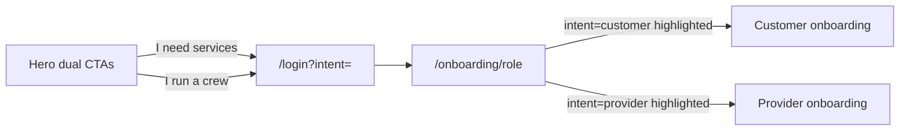

# Dual-path landing + navy/lime rebrand

Cyan (`#02ddf5` in [apps/web/tailwind.config.js](apps/web/tailwind.config.js)) currently reads as generic tech/SaaS. **Ink navy + lime** is a better Exterior Pro identity: navy = professional ops platform for providers, lime = outdoor energy and high-contrast CTAs for homeowners.

This pass rebrands **the landing page and the login/role funnel** so the first 30 seconds feel like one company. Dashboards stay on cyan until a follow-up; we will add tokens so that later migration is a swap, not a rewrite.

## Brand system

Add semantic tokens in [apps/web/src/app/globals.css](apps/web/src/app/globals.css) and Tailwind in [apps/web/tailwind.config.js](apps/web/tailwind.config.js):

- **Ink navy** `#0B1F33` — surfaces, dark panels, headlines in light mode
- **Lime** `#C8F542` — primary CTAs, highlights, “alive” accents
- **Lime foreground** `#0A1208` — text on lime buttons (not white; higher contrast)
- **Night** `#070B12` — dark canvas (navy-tinted black, not pure crypto-black)
- **Mist** `#F4F6F0` — light-mode page background (slightly warm, not sterile white)

Map `--primary` to lime so shadcn `Button` can become the brand CTA on landing without a one-off class soup. Keep the existing custom `cyan` scale so the rest of the app does not break.

Load **Outfit** via `next/font` in [apps/web/src/app/layout.tsx](apps/web/src/app/layout.tsx) for a geometric, premium marketplace voice (no serif — navy/lime wants precision, not “lawn flyer”).

Update the hardcoded cyan highlight in [apps/web/src/components/ui/hover-border-gradient.tsx](apps/web/src/components/ui/hover-border-gradient.tsx) (`#02ddf5` → lime) so shared buttons match.

## Conversion architecture

The current page is a customer story with a provider section bolted on. Every primary CTA also dumps to `/login` with no audience intent.

- Homeowner CTA → `/login?intent=customer`
- Provider CTA → `/login?intent=provider`
- Login preserves `intent` through OTP, then sends new users to `/onboarding/role?intent=...`
- Role page **highlights** the matching card (does not auto-submit — people still confirm)

## Page structure (dual-path, not customer-first)

Rewrite composition in [apps/web/src/components/landing/landing-page.tsx](apps/web/src/components/landing/landing-page.tsx) and supporting sections:

1. **Navbar** — For homeowners / For providers / How it works. Primary lime **Get started**. Sign in stays quiet.
2. **Hero** — Dual-audience, not “your property on autopilot” only.
   - Headline direction: _The operating system for exterior work._
   - Subcopy that names both jobs: recurring plans + bidding for homeowners; jobs + crew tools for providers.
   - Two equal CTA cards (not a primary + ghost): **Get my property handled** / **Grow my crew’s book of work**.
   - Keep a product preview, but drop meteors and dual cyan spotlights. Lime glow + navy panel only.
3. **Trust strip** — Replace vanity stats (`3 subscription plans`) with conversion proof: verified providers, pause anytime, recurring + on-demand, crew ops included.
4. **How it works** — Tabbed: Homeowners vs Providers. Current timeline in [how-it-works-section.tsx](apps/web/src/components/landing/how-it-works-section.tsx) is customer-only.
5. **Plans** then **Services** — homeowner conversion, lime “Most popular” treatment.
6. **Why Exterior Pro** — keep the Angi/Thumbtack contrast; retint icons/borders to navy/lime.
7. **Providers** — full-bleed navy “command center” with lime numbers. Copy stays ops-platform, not lead-gen.
8. **FAQ** — mix of both audiences (already partly there).
9. **Closing CTA** — split panel: homeowners left, providers right. Current [cta-section.tsx](apps/web/src/components/landing/cta-section.tsx) only asks “Ready to transform your property?”
10. **Footer** — real stacked logo, not the cyan “EP” square.

Copy lives in [apps/web/src/components/landing/data.ts](apps/web/src/components/landing/data.ts): add `HOW_IT_WORKS_PROVIDER`, dual CTA labels, and a trust-strip list.

## Visual rules (make it feel branded, not Aceternity-template)

Keep motion where it sells (hero preview float, plan glow). Cut crypto-SaaS noise:

- Remove meteor rain
- One spotlight max, lime, low opacity
- Infinite marquee can stay as a thin capability ticker under the hero
- Footer uses `/logos/logo-stacked-lime.png`
- Buttons: lime fill + ink text; secondary = navy/outline, never cyan

## Auth funnel (small, high leverage)

- [apps/web/src/app/(auth)/login/page.tsx](<apps/web/src/app/(auth)/login/page.tsx>): read `intent`, forward to role
- [apps/web/src/app/(auth)/onboarding/role/page.tsx](<apps/web/src/app/(auth)/onboarding/role/page.tsx>): highlight the matching path; retint hover to lime so the funnel matches the landing

Do **not** mass-replace `cyan-*` across customer/provider dashboards in this pass.

## Out of scope

- Native app cyan (`#02ddf5` in RN)
- Dashboard/admin recolor
- New illustrations or logo redraw (use existing `/logos/*`)
