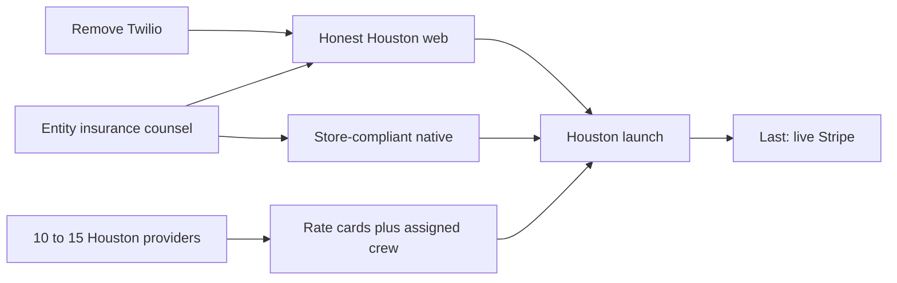

# Launch readiness: what is left

The [operating plan](apps/web/src/content/business-plan.ts) is the right filter: **Houston beachhead, supply first, marketplace jobs at 10% can scale now, do not sell subscriptions until contracted visit rates exist.** Reviews and in-app job messaging have shipped since the plan was last written (August 23, 2026) — those rows in the “Not yet” table are stale.

You asked for **web + store at the same time**. That pulls native App Store / Play work into the launch bar.

**Explicit deferrals from this round:**

- **Stripe stays in test mode.** No live keys, live Connect identity, Tax, or webhook hardening until everything else is done. Checkout/Billing/Connect already work against the test environment.
- **Twilio/SMS comes out entirely.** Auth is email OTP. Job alerts should be in-app + push + email, not text.

---

## Already launch-capable (do not rebuild)

**Web:** email OTP, customer/provider/admin portals, job post → bid → Checkout → transfer-on-complete, subscriptions + Billing Portal, Stripe Connect gate on bidding (test mode), photos, job chat, reviews, tips, crews, admin catalog/money views.

**Native:** same customer flows plus field Today / jobs / photos / complete / crew map / messaging. Real tRPC, not mocks.

**Do not build before launch:** Stripe Tax, live Stripe cutover, property-manager org role, commercial quotes, route optimization, Checkr, PostHog, city feature flags, CRM, invoice PDFs, destination charges.

---

## P0 — Launch blockers

### 0. Remove Twilio / SMS

Auth already uses email OTP. SMS is leftover infrastructure for job alerts. Tear it out rather than leaving a dead vendor.

Delete / stop using:

- [packages/api/src/lib/sms.ts](packages/api/src/lib/sms.ts)
- `twilio` dependency in [packages/api/package.json](packages/api/package.json)
- `sendSms` path in [packages/api/src/lib/notifications.ts](packages/api/src/lib/notifications.ts) (keep in-app + Expo push)
- `TWILIO_*` from [.env.example](.env.example), [turbo.json](turbo.json), and any local `.env`
- Privacy copy that names Twilio / “optional SMS” in [privacy/page.tsx](apps/web/src/app/privacy/page.tsx)
- Business-plan lines that still say “keep SMS for urgent” in [business-plan.ts](apps/web/src/content/business-plan.ts)

**Keep `User.phone` / crew phones.** Native still uses them for `tel:` (call the customer / provider). Do not add a phone mutation “so SMS fires.” Optional later: collect phone only as a contact number on profile/crew, never as an auth channel.

Notifications after teardown: in-app + push, plus the P1 transactional emails for money events.

### 1. Company work (non-code)

Software will not make this look like a company. Before paid ads:

- LLC/Inc., EIN, business bank, GL insurance
- Spreadsheet COI for the first dozen providers is enough
- Counsel review of [terms](apps/web/src/app/terms/page.tsx), [privacy](apps/web/src/app/privacy/page.tsx), and [contractor agreement](apps/web/src/app/contractor-agreement/page.tsx) — they still say “launch draft”
- One support inbox. Today web legal pages use `support@exteriorpro.app`; native settings use `support@exteriorpro.com`

Stripe live identity (legal name on receipts matching the Stripe platform account) waits for the **last** step, when test keys are swapped.

### 2. Do not sell plans until rate cards exist

Highest-probability financial failure in the plan. Cron in [subscription-jobs.ts](packages/api/src/lib/subscription-jobs.ts) pays `customPrice ?? basePrice`. At catalog rates every seeded plan loses money (Basic ~−$110/mo).

Ops rule: **one-time jobs can launch now** (Stripe test charges until the final cutover). Basic/Standard/Premium only in ZIPs where the assigned crew signed the Houston rate card.

Product still missing:

- No API/UI to set `CustomerSubscription.assignedProviderId` (only seed data)
- No admin/provider UI to set contracted `ProviderService.customPrice`
- Optional: hide or waitlist plan checkout in ZIPs without a signed card

### 3. Honest Houston marketing

Landing [STATS](apps/web/src/components/landing/data.ts) claim 12,400+ jobs, 4.9/5, 38% revenue lift. Testimonials use Franklin TN / Cary NC / Scottsdale while ops is Greater Houston. Testimonials section is commented out; “Coming Soon — December 2026” still sits on the mobile app section even if you ship the app.

Before paid traffic: replace stats with real or qualitative copy, Houston-only geography, and stop advertising a coming-soon app if the binary is live.

### 4. Native store compliance (simultaneous launch)

| Blocker                          | Where                                                                                                                                                                |
| -------------------------------- | -------------------------------------------------------------------------------------------------------------------------------------------------------------------- |
| Production API URL / EAS secrets | [trpc.ts](apps/native/src/lib/trpc.ts) falls back to localhost; [eas.json](apps/native/eas.json) has no env; `EXPO_ACCESS_TOKEN` not in [.env.example](.env.example) |
| iOS push entitlements            | [ExteriorPro.entitlements](apps/native/ios/ExteriorPro/ExteriorPro.entitlements) is empty — APNs will not work                                                       |
| Account deletion                 | Apple 5.1.1(v). Field settings is “Coming Soon”; customer settings has none                                                                                          |
| Privacy / Terms in-app           | Required by both stores; native has no links to web legal pages                                                                                                      |
| Permission audit                 | `RECORD_AUDIO`, microphone, Face ID strings with no matching feature — review risk                                                                                   |
| Privacy nutrition labels         | [PrivacyInfo.xcprivacy](apps/native/ios/ExteriorPro/PrivacyInfo.xcprivacy) claims no collected data; you collect email, photos, device tokens, map coords            |
| Store listing                    | Screenshots, support URL, Data safety / privacy labels, dual-audience copy (customer + field in one binary `com.exteriorpro.field`)                                  |

Also wire cold-start notification tap (`getLastNotificationResponse` exists, unused) and a real `EXPO_PUBLIC_API_URL`.

### 5. Houston ZIP allowlist

Plan open decision: “product currently allows any ZIP a provider types.” [houston-zips.ts](apps/web/src/content/houston-zips.ts) is a picker helper, not a hard gate. Reject or waitlist jobs/properties/provider areas outside the launch list, and put “we serve Greater Houston” on the landing.

---

## P1 — Ship with launch or in week one

- **Provider job notes API** — web job detail saves with a toast but has `// TODO: Add API endpoint` in [provider/jobs/[id]/page.tsx](<apps/web/src/app/(provider)/provider/jobs/[id]/page.tsx>)
- **Transactional email for money events** — OTP is branded; receipts/job confirm are plain text. Wire unused helpers in [notifications.ts](packages/api/src/lib/notifications.ts) at least for bid received, payout sent, subscription cancelled (replaces the SMS we are deleting)
- **Support lookup** — admin search by email is enough once SMS is gone; confirm the inbox is monitored
- **404 + branded global error**, sitemap/robots, OG image
- **Geocode properties on create** — lat/lng columns exist; native crew map falls back to hardcoded Houston city centers
- Align native support email with web; add privacy/terms links on both field and customer settings

---

## P2 — After first paid jobs (plan “Now” list)

Do not let these delay Houston go-live if P0 is done:

- Provider week calendar (marketing mentions “smart scheduling”; product is list-only)
- COI / insurance attestation in-product (spreadsheet is enough for the first dozen)
- Admin plan CRUD instead of seed + `sync-launch-plans` script
- Customer profile edit on native (mutation exists, UI is read-only)
- In-app notification inbox on native (`notification.list` is unused)
- Light offline cache for field Today (NetInfo/AsyncStorage are installed, unused)
- Customer “need a refund?” path to support (no in-product refunds UI)

---

## Last — production Stripe (do this after everything else)

Keep using Stripe **test** keys, test webhooks, and test Connect for the whole build-and-store-submit cycle. Real money is the final cutover:

- Live `STRIPE_SECRET_KEY` / publishable key / webhook secret / Connect
- Stripe platform identity matching the legal entity on receipts
- Webhook idempotency (no processed-event table today)
- Stripe Tax only after nexus is known (still not a launch product task)

Until then, treat Checkout, Billing, and Connect as already implemented.

---

## Suggested launch sequence

1. **Remove Twilio** and company/counsel/insurance in parallel
2. **Supply:** onboard 10–15 Houston providers with Connect payouts **in test** in a tight ZIP cluster
3. **Product P0:** ZIP gate, assigned subscription provider + rate-card prices, honest landing, native store pack
4. **Soft launch on test Stripe:** one-time jobs only in those ZIPs; hold Standard/Premium until cards are signed
5. **Store submit** once deletion, legal links, push, and production API URL are real
6. **Demand ads** only after empty-bid-list risk is gone
7. **Last:** flip Stripe to live keys and platform identity

The 12-month targets in the plan (12 verified providers / 15 subs / 20 one-time jobs by month 3) only work if you follow this order. Empty bid lists and catalog-priced subscriptions are the two failure modes the plan already named.
