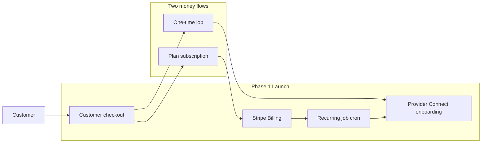

# Exterior Pro launch and full-suite roadmap

You already have a working **web marketplace**: phone auth, customer/provider/admin portals, properties, job request → bid → schedule → complete, subscription plans in the database, and in-app + SMS notifications. What is missing is the layer that makes this a company people can trust with money and property: **real billing, provider payouts, legal, production hardening, and service fulfillment automation**.

You chose **hybrid**: Exterior Pro sells homeowner subscription plans **and** runs a one-time job marketplace with provider payouts. You asked for a **phased roadmap** so you can pick what to build next.

---

## Where the product stands today

**Ready:** customer job wizard, bid accept/decline, provider bidding and crews, admin verification, subscription CRUD in the DB, Stripe webhook **receiver** at [`apps/web/src/app/api/webhooks/stripe/route.ts`](apps/web/src/app/api/webhooks/stripe/route.ts).

**Not ready for real money:** [`subscription.subscribe`](packages/api/src/routers/subscription.ts) creates a DB row with **no Checkout Session**. Seeded plans have empty `stripePriceId*`. There is no job payment, no Connect account on [`ProviderProfile`](packages/db/prisma/schema.prisma), no payouts. Landing-page prices in [`apps/web/src/app/page.tsx`](apps/web/src/app/page.tsx) do not match seeded plans.

**Not ready as a company:** Terms/Privacy are non-links, JWT lives in a non-httpOnly cookie ([`apps/web/src/lib/auth.ts`](apps/web/src/lib/auth.ts)), no email, no error tracking, no CI, no cron to turn subscriptions into actual visits.

Mobile ([`apps/native`](apps/native)) is a stub. Do **not** block web launch on it.

---

## Recommended money model (Stripe)

Exterior Pro is a **marketplace**: your name is on the customer receipt, you handle refunds, you pay providers.

**Recommended Connect setup** (Accounts v2):

- Lightweight Express dashboard for providers + embedded onboarding
- Platform owns pricing (`fees_collector: application`)
- Platform owns negative-balance liability (`losses_collector: application`) — required for this payout pattern
- **Separate charges and transfers** (delivery-gated payout): collect on the platform, hold until the visit is done, then transfer the provider’s share

**Flow A — subscription plans (homeowner pays Exterior Pro)**

1. Customer picks plan + property → Stripe Checkout (Billing).
2. Webhook already expects `checkout.session.completed` / `invoice.paid` / `invoice.payment_failed` / `customer.subscription.deleted` — wire Checkout to actually create those sessions and fill `stripeProductId` / `stripePriceId*` on plans.
3. A cron generates `Job` rows from [`PlanService`](packages/db/prisma/schema.prisma) frequencies (this does not exist today).
4. Assigned provider completes the visit → Transfer from platform balance to their connected account.

**Flow B — one-time jobs (bid marketplace)**

1. Customer accepts a bid → Checkout/PaymentIntent for the bid amount (platform is merchant of record).
2. Funds sit on the platform until `JobStatus.COMPLETED`.
3. Transfer `bid.price - platformFee - estimated Stripe processing` to the provider.

Do **not** use destination charges for either flow: they transfer immediately and cannot hold funds until the work is done. Stripe Billing also does not pair well with destination charges.

**Margin note:** with this pattern the **platform pays Stripe processing fees**. Bake processing (~2.9% + 30¢) into the platform fee or net transfer math, or subscription margins will go negative. Monitor the [Connect margin report](https://docs.stripe.com/connect/margin-reports.md). Default take-rate to confirm: **15–20% on one-time jobs**; for plans, keep the full plan price and pay providers a **per-visit rate** (not a %).

**In code vs Dashboard**

- Code: Checkout Sessions, PaymentIntents, Transfers + reversals, Connect account create, webhook handlers, `application_fee` math as a **net transfer** (separate charges cannot use `application_fee_amount`).
- Dashboard: restricted API keys (`rk_`), webhook endpoint, Connect platform profile, Radar, payout schedule, tax registrations before turning on Stripe Tax.

Use `StripeClient` (not the deprecated global key pattern) and omit `payment_method_types` so Dynamic Payment Methods work from the Dashboard.

---

## Phase 1 — Launch blockers (must-have)

Without this, people cannot actually pay you or get paid, and subscriptions never become work.

### 1. Payments that charge

- Create Stripe Products/Prices for each [`SubscriptionPlan`](packages/db/prisma/schema.prisma); stop creating unpaid DB subscriptions.
- Replace `subscription.subscribe` with Checkout Session creation; let the existing webhook insert `CustomerSubscription`.
- Customer Billing Portal for pause/cancel/update card (today pause/cancel is DB-only).
- On bid accept: collect payment before the job moves to `PENDING`.
- Persist `Payment` / `Transfer` records (jobId, amounts, Stripe IDs, status).
- Receipts: Stripe-hosted or a simple “Payments” page.

### 2. Provider payouts (Connect)

- Add `stripeAccountId` (and onboarding status) to `ProviderProfile`.
- Embedded Connect onboarding + `notification_banner` + `account_management` on the provider portal.
- Gate bidding/assignment on `payouts_enabled`.
- Transfer on job complete; handle refunds/disputes by reversing transfers.
- 1099-K / tax reporting via Stripe for US providers.

### 3. Subscription fulfillment (or plans are a lie)

- Vercel Cron (or equivalent) to generate upcoming `Job` rows from active subscriptions + `PlanService.frequency`.
- Assign or broadcast those jobs to providers in the zip.
- Expire stale bids; send job reminders (SMS already exists in [`packages/api/src/lib/notifications.ts`](packages/api/src/lib/notifications.ts)).

### 4. Legal and trust pages

- Real `/terms` and `/privacy` (have a lawyer write them; we add routes and footer links).
- Independent contractor / provider agreement during provider onboarding.
- Cookie/session consent only if you add analytics.

### 5. Production hardening

- Hosted MySQL (keep Prisma/MySQL; do not migrate DBs for launch).
- Vercel deploy, `.env.example`, `STRIPE_*`, `JWT_SECRET`, Twilio, webhook secret.
- **httpOnly, Secure cookies** for JWT (stop writing `auth-token` from the client).
- Sentry (errors) + Resend (transactional email: receipts, job confirmations). Email is stored on profiles today and never sent.
- Align marketing prices with DB plans on the landing page.
- Basic CI: `prisma validate` + `turbo build` on PRs.

**Explicitly out of Phase 1:** mobile app, chat, photos, maps, property-manager role, Stripe Tax (until you have a [tax registration](https://docs.stripe.com/tax.md)), reviews.

---

## Phase 2 — Makes it feel like a real ops company

Build this as soon as first paying customers exist.

- **Before/after photos** (Vercel Blob) on jobs — the #1 trust feature for exterior work.
- **Reviews/ratings** after completion.
- **In-app messaging** customer ↔ provider (keep SMS for urgent).
- **Calendar** for providers (week view of scheduled jobs).
- **Admin revenue**: GMV, take rate, failed payments, payouts, disputes.
- **Provider earnings** page (embedded `payments` + `payouts` components).
- Insurance attestation / COI upload for providers.
- Support path: `support@` inbox + admin “impersonate/lookup user by phone”.
- Stripe Tax + registrations once you know nexus.

---

## Phase 3 — Full suite / “tech company” surface area

This is how you look like LawnStarter/TaskRabbit/PropertyMeld, not a prototype.

| Capability                                  | Why it matters                                               |
| ------------------------------------------- | ------------------------------------------------------------ |
| **Expo mobile** (reuse tRPC)                | Crews will not update job status from a laptop in a driveway |
| **Property manager role**                   | Commercial: one login, many properties, shared billing       |
| **Commercial quotes**                       | Sqft/HOA/multi-building, not just residential FLAT bids      |
| **Maps / service-area polygons**            | Zip strings will break as you grow                           |
| **Route grouping**                          | Same-day multi-stop for lawn/gutter crews                    |
| **Job checklist + materials**               | Crew quality control                                         |
| **Saved cards / SetupIntents**              | Faster checkout on repeat one-time jobs                      |
| **Financing / seasonal prepay**             | Higher ticket pressure washing, painting                     |
| **Background checks**                       | Homeowner trust (Checkr or similar)                          |
| **Analytics** (PostHog or Vercel Analytics) | Funnel: visit → login → first job/plan                       |
| **Feature flags**                           | City-by-city launch                                          |
| **App Store / Play**                        | After the Expo app is real                                   |

Company work that is **not code** but is required to look legitimate: legal entity + EIN, business bank account, general liability insurance, domain + Google Workspace/email, state contractor-broker rules (some states treat marketplaces as contractors), and a defined launch city (do not go national on day one).

---

## Suggested build order after you approve

Start **Phase 1 only**, in this sequence:

1. Stripe products + Checkout for plans (reuse existing webhook).
2. Job payment on bid accept + Payment records.
3. Connect onboarding + transfer-on-complete.
4. Subscription job-generation cron.
5. httpOnly auth cookies, legal pages, Resend, Sentry, Vercel + env docs.

Default decisions baked into that work (change if you want): **Express dashboard, platform-owned pricing and losses, separate charges and transfers, 15–20% job take rate, per-visit provider pay on plans, web-only launch.**
