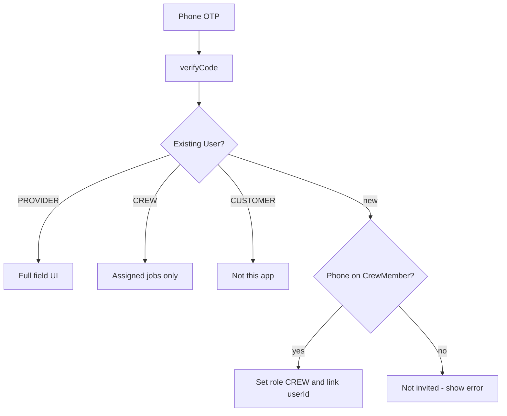
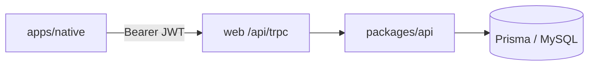

# Native field app (provider + crew)

## Current state

[`apps/native`](apps/native) is an Expo SDK **53** stub (RN 0.79, expo-router 5, one placeholder screen). No NativeWind, no auth, no tRPC. All product logic lives in [`packages/api`](packages/api) and the web portal at [`apps/web/src/app/(provider)/provider/`](<apps/web/src/app/(provider)/provider/>).

Crews today are **not users**. [`CrewMember`](packages/db/prisma/schema.prisma) is a name/phone record. Only `UserRole`: `CUSTOMER | PROVIDER | ADMIN`.

Latest stable Expo is **SDK 57** (`expo@57.0.9`, RN 0.86.2, React 19.2). Jumping 53 → 57 is safe here because the native app has almost no custom code.

## Milestone 1 — in vs out

**In (field-first)**

- Expo 57 + NativeWind for all styling
- Phone OTP login for **providers and crew members**
- Today / job list / job detail
- Start and complete jobs
- Provider: assign a crew
- Tap address to open Apple/Google Maps
- Call customer (if phone is available)
- Sign out

**Out (later)**

- Quotes/bidding, payouts, profile, dashboard stats
- Job photos, GPS check-in, in-app chat, offline sync, push
- Customer native app

## Crew identity (new product work)

Same phone OTP as web. If the number matches a `CrewMember.phone`, that person becomes a `CREW` user automatically — they never pick a role.



**Permissions**

- **Provider:** all company jobs, schedule if needed, assign crew, start/complete, navigate
- **Crew:** only jobs assigned to their crew; start/complete and navigate; no assign/schedule/crew admin
- A phone that is already `CUSTOMER` or `PROVIDER` is not auto-converted to `CREW`

**Schema** ([`packages/db/prisma/schema.prisma`](packages/db/prisma/schema.prisma))

- Add `CREW` to `UserRole`
- Add optional unique `userId` on `CrewMember` (link to `User`)
- Require `phone` in `+1XXXXXXXXXX` when adding a member so they can log in

**API**

- `crewProcedure` in [`packages/api/src/trpc.ts`](packages/api/src/trpc.ts)
- `auth.verifyCode` / `auth.me`: auto-link crew, return crew membership
- `job.listMine` (or `listForCrew`): jobs for the signed-in provider **or** assigned crew
- `job.getById`: scoped the same way
- `job.updateStatus`: allow `CREW` for `IN_PROGRESS` / `COMPLETED` on assigned jobs only (not cancel)
- `job.assignCrew` / `crew.*` stay provider-only
- Keep web `providerProcedure` routes unchanged so the portal keeps working

## Native app architecture

tRPC already accepts `Authorization: Bearer` ([`packages/api/src/trpc.ts`](packages/api/src/trpc.ts)). Native stores the JWT in SecureStore and talks to the web app’s `/api/trpc`.



**Routes (expo-router)**

```
apps/native/app/
  _layout.tsx              # NativeWind CSS, tRPC, auth gate
  (auth)/login.tsx         # phone + OTP
  (field)/_layout.tsx      # bottom tabs
  (field)/index.tsx        # Today
  (field)/jobs/index.tsx   # Upcoming / all
  (field)/jobs/[id].tsx    # Detail + actions
  (field)/account.tsx      # role, crew name, sign out
```

Providers get an extra **Assign crew** action on job detail (sheet of existing crews). No dense crews-admin screen in this milestone — members are still added on web, but phone becomes required so they can log in.

**UI:** large tap targets, status chips, one-thumb actions (Start / Complete / Navigate). All styles via NativeWind `className` — no `StyleSheet`. Match the web dark/light tokens where practical.

## Phase 1 — Expo 57 + NativeWind

In [`apps/native`](apps/native):

1. `npx expo install expo@^57.0.0 --fix` (pins RN 0.86.2 / React 19.2 / expo-router for SDK 57)
2. Bump root `engines.node` toward **22.13+** (SDK 57 requirement)
3. NativeWind **v4 stable** + Tailwind 3 (v5 is still preview):
   - `nativewind`, `react-native-reanimated`, `tailwindcss@^3.4`
   - `global.css`, `tailwind.config.js` with `nativewind/preset`
   - Babel `jsxImportSource: "nativewind"` + `nativewind/babel`
   - Wrap existing monorepo Metro config with `withNativeWind`
4. Rename app from `com.turbo.example` / “native” to Exterior Pro field app
5. Point `dev` at `expo start` (not `--web`)
6. Smoke-test a `className` screen in iOS Simulator / Expo Go

If NativeWind v4 breaks on SDK 57 Metro (known pain on SDK 56), switch to NativeWind v5 preview rather than blocking.

## Phase 2 — Auth + tRPC client

- `@trpc/client` + `@tanstack/react-query` + `superjson` + `@repo/api` types
- `EXPO_PUBLIC_API_URL` (simulator: `http://localhost:3000`; Android emulator: `http://10.0.2.2:3000`)
- SecureStore session; send `Authorization: Bearer`
- Login: phone → OTP → route `PROVIDER`/`CREW` into `(field)`, everyone else sees a clear “not invited” state
- Web login: if `role === CREW`, don’t send them through customer/provider onboarding

## Phase 3 — Field screens

Reuse status/date helpers from [`apps/web/src/app/(provider)/provider/_components/utils.ts`](<apps/web/src/app/(provider)/provider/_components/utils.ts>) (copy or extract a tiny shared util — don’t import Next.js pages).

- **Today:** jobs scheduled today (crew: assigned only)
- **Job detail:** service, address, time, customer notes, assigned crew, big Start / Complete
- **Navigate:** `Linking.openURL` to Apple Maps / Google Maps from `property.address`
- **Call:** customer phone when present
- **Provider assign:** existing `job.assignCrew` + `crew.list`
- Empty states: “No jobs today”, “Ask your owner to add your phone to a crew”

## Phase 4 — Seed + verify

- Seed at least one `CREW` user linked to an existing `CrewMember` in [`packages/db/prisma/seed.ts`](packages/db/prisma/seed.ts)
- Manual check: provider login sees all jobs; crew login sees only assigned; start/complete updates web portal

## Not in this PR

EAS Build, push notifications, photos, bidding, Stripe Connect, customer app.
